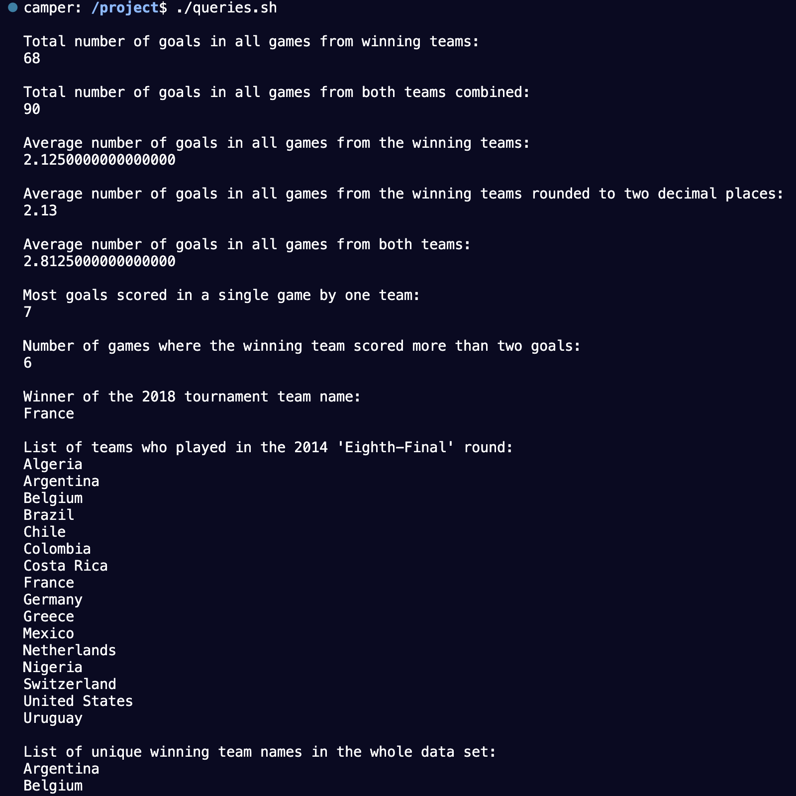

# World Cup Database

The insert_data.sh bash script enters information from World Cup games csv file into PostgreSQL. Then you can run `queries.sh` in a bash terminal to query the database for useful statistics.

